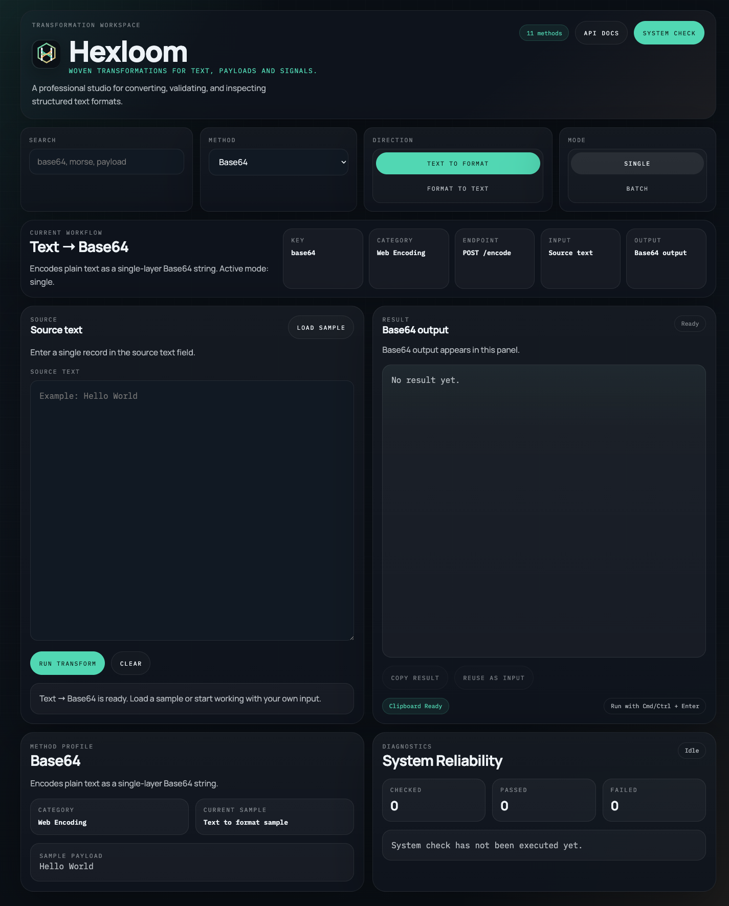
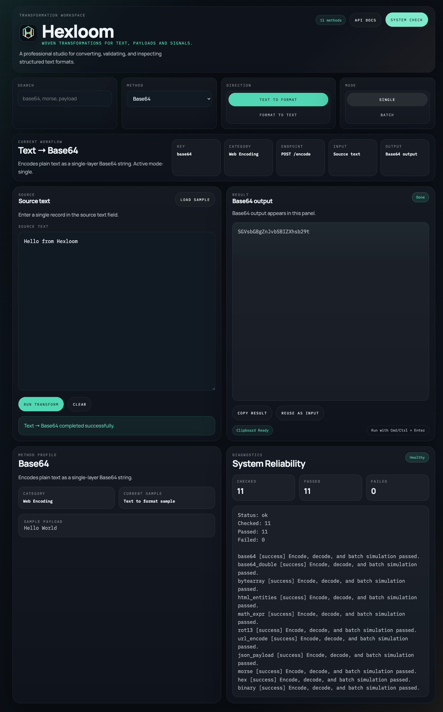

# Hexloom

[](https://github.com/batu3384/hexloom/actions/workflows/ci.yml)
[](https://hexloom.onrender.com)
[](LICENSE)
[](pyproject.toml)

Hexloom is a FastAPI-based text transformation studio for encoding, decoding, validating, and inspecting structured payloads through a single operational interface.

It combines a browser workspace, JSON API endpoints, batch processing, built-in diagnostics, and deployment-ready packaging for teams working with Base64, Morse, Binary, Hex, JSON wrappers, and related text formats.

## Live links

- Live app: [https://hexloom.onrender.com](https://hexloom.onrender.com)
- API docs: [https://hexloom.onrender.com/docs](https://hexloom.onrender.com/docs)
- Health check: [https://hexloom.onrender.com/health/transformations](https://hexloom.onrender.com/health/transformations)



## What Hexloom provides

- Eleven transformation methods exposed through one consistent interface
- Single-item and batch workflows from the same product surface
- FastAPI backend with OpenAPI and Swagger documentation
- Built-in self-check endpoint for transformation reliability
- Rich terminal request logging and tqdm-backed batch progress
- Local static frontend assets with no Tailwind CDN dependency
- Docker, Render, and GitHub-ready repository structure

## Supported methods

| Method | Purpose |
| --- | --- |
| `base64` | Single-layer Base64 encode and decode |
| `base64_double` | Double-pass Base64 encode and decode |
| `bytearray` | Byte payload templating with `exec(bytes([...]))` output |
| `html_entities` | HTML entity encoding and decoding |
| `math_expr` | Ordinal math-expression encoding without unsafe `eval()` decode |
| `rot13` | ROT13 text rotation |
| `url_encode` | URL-safe percent encoding |
| `json_payload` | JSON payload wrapping with structured decode |
| `morse` | International Morse code transform |
| `hex` | Hexadecimal representation |
| `binary` | Binary representation |

## Product surface

### Workspace

The main workspace is designed for quick operator workflows:

- choose a method
- switch between `Text to Format` and `Format to Text`
- run single or batch jobs
- inspect the active workflow and method metadata
- copy or reuse output safely



### Diagnostics

Hexloom exposes `GET /health/transformations`, which runs encode, decode, and batch simulation checks across the supported methods. This makes the application useful both as an operator tool and as a deployment readiness probe.

## API overview

### Single transform

- `POST /encode`
- `POST /decode`

Request:

```json
{
  "data": "Hello World",
  "method": "base64"
}
```

Success response:

```json
{
  "status": "success",
  "result": "SGVsbG8gV29ybGQ=",
  "clipboard_ready": true
}
```

Error response:

```json
{
  "status": "error",
  "result": null,
  "message": "Geçerli bir Base64 metni bekleniyordu.",
  "clipboard_ready": false
}
```

### Batch transform

- `POST /bulk/encode`
- `POST /bulk/decode`

Request:

```json
{
  "method": "binary",
  "items": ["01001000 01101001", "01001000 01100101 01111000"]
}
```

## Local development

```bash
python3 -m venv .venv
.venv/bin/pip install -e '.[dev]'
.venv/bin/uvicorn app.main:app --host 127.0.0.1 --port 8000
```

Open:

- `http://127.0.0.1:8000`
- `http://127.0.0.1:8000/docs`
- `http://127.0.0.1:8000/health/transformations`

If you want correct canonical and social-sharing URLs outside localhost, define:

```bash
export HEXLOOM_PUBLIC_URL="https://your-domain.example"
```

## CLI entry point

```bash
.venv/bin/hexloom
```

## Docker

```bash
docker build -t hexloom .
docker run --rm -p 8000:8000 hexloom
```

## Deployment

### Render

The repository includes [`render.yaml`](render.yaml), so Render can provision the service directly from GitHub.

### Other platforms

Use the included [`Dockerfile`](Dockerfile) for Fly.io, Google Cloud Run, or any container-based VPS deployment.

## Quality checks

```bash
.venv/bin/pytest -q
python3 -m build
python3 -m twine check dist/hexloom-0.1.2*
```

## Tech stack

- FastAPI
- Pydantic
- Jinja2
- Rich
- tqdm
- pytest
- httpx

## Repository layout

```text
.
├── app/
├── docs/
│   └── assets/
├── static/
├── templates/
├── tests/
├── CHANGELOG.md
├── CONTRIBUTING.md
├── Dockerfile
├── LICENSE
├── SECURITY.md
├── pyproject.toml
└── render.yaml
```

## Project hygiene

- Release history: [CHANGELOG.md](CHANGELOG.md)
- Contribution guide: [CONTRIBUTING.md](CONTRIBUTING.md)
- Security policy: [SECURITY.md](SECURITY.md)
- Current stable release: [`v0.1.2`](https://github.com/batu3384/hexloom/releases/tag/v0.1.2)

## License

Hexloom is released under the [MIT License](LICENSE).
